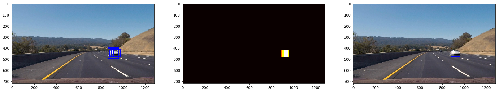
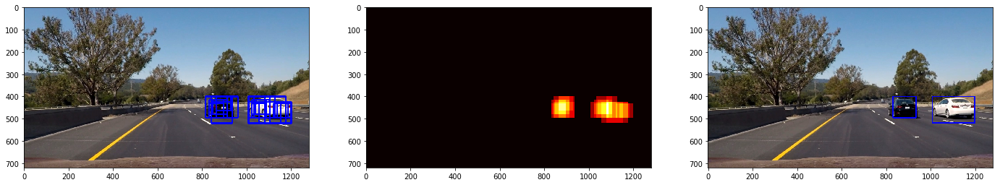

## ***Vehicle Detection Project***

The goals / steps of this project are the following:

* Perform a Histogram of Oriented Gradients (HOG) feature extraction on a labeled training set of images and train a classifier Linear SVM classifier
* Optionally, you can also apply a color transform and append binned color features, as well as histograms of color, to your HOG feature vector. 
* Note: for those first two steps don't forget to normalize your features and randomize a selection for training and testing.
* Implement a sliding-window technique and use your trained classifier to search for vehicles in images.
* Run your pipeline on a video stream (start with the test_video.mp4 and later implement on full project_video.mp4) and create a heat map of recurring detections frame by frame to reject outliers and follow detected vehicles.
* Estimate a bounding box for vehicles detected.

### Here I will consider the rubric points individually and describe how I addressed each point in my implementation.

### Histogram of Oriented Gradients (HOG)
### 1. Explain how (and identify where in your code) you extracted HOG features from the training images.
* The code for this step is in the third cell of IPython notebook, which consists of functions for extracting hog features, color histogram as well as spatial features. 
First of all, in the second cell of Ipython notebook, I read all the vehicle and non-vehicle images from `Vehicle` and `non-Vehicle` datasets, which is shown below:


```python

## import the vehicle images from small dataset
#vehicle_location=glob.glob('./data/vehicles_smallset/*/*.jpeg')
vehicle_location=glob.glob('./data/vehicles/*/*.png')
non_vehicle_location=glob.glob('./data/non-vehicles/*/*.png')
#non_vehicle_location=glob.glob('./data/non-vehicles_smallset/*/*.jpeg')
print('the number of vehicle images:', len(vehicle_location))
print('the number of non-vehicle images:', len(non_vehicle_location))
cars_img=[]
notcars_img=[]
for file in vehicle_location:
    img=cv2.imread(file)
    img=cv2.cvtColor(img, cv2.COLOR_BGR2RGB)
    cars_img.append(img)
    
for file in non_vehicle_location:
    img=cv2.imread(file)
    img=cv2.cvtColor(img, cv2.COLOR_BGR2RGB)
    notcars_img.append(img)
    
    

# Plot the examples ################################
car_image=cars_img[np.random.randint(0,len(cars_img))]
notcar_image=notcars_img[np.random.randint(0,len(notcars_img))]
fig = plt.figure(figsize=(8,8))
plt.subplot(121)
plt.imshow(car_image)
plt.title('Example Car Image')
plt.subplot(122)
plt.imshow(notcar_image)
plt.title('Example Not-car Image')
print('The shape of image:', car_image.shape)
```

    the number of vehicle images: 8792
    the number of non-vehicle images: 8968
    The shape of image: (64, 64, 3)
    


I then explored different color spaces and different `skimage.hog()` parameters (`orientations`, `pixels_per_cell`, and `cells_per_block`). I grabbed random images from each of the two classes and displayed them to get a feel for what the `skimage.hog()` output looks like. also, I appended the color histogram and spatial features to hog feature so that we can feed those more features into SVM and SVM can get more information out of training sets.

In the later section, I trained the different color spaces using SVM and compared with each other with subject to test accuracy as well as time consumed for the training, and eventually `YCrCb` color space turned out to be better than any of those. 
Here is an example using the `YCrCb` color space and HOG parameters of `orientations=9, pixels_per_cell=(8, 8) and cells_per_block=(2, 2)`:

### 2. Explain how you settled on your final choice of HOG parameters.
There are number of parameters that I can choose, here is my answer for the final choice of HOG parameters:

| Orientations  | pixels_per_cell   | cells_per_block  |color space  |
| ------------- |:-----------------:| ----------------:| -----------:|
| 9             | 8                 | 2                |YCrCb        |

In order to get the final choice of HOG parameters, I have tried different combinations of `orientation`, `pix_per_cell`, `cell_per_block`, `color space`, and my choice are based on the outcome of test accuracy of SVM classifier as well as time spent on the training and testing. For the combination of my choice, the SVM is able to achieve `99.46% `of test accuracy and within 4 secs of training. 

The final length of extracted features on both training and testing data sets is:

`
The length of color feature vectors: 96
The length of spatial feature vectors: 3072
The length of hog feature vectors: 1764
The length of all feature vectors: 8460
`


```python
def hog_feature(img, orient, pix_per_cell, cell_per_block, vis=False, feature_vct=True):
    if vis==True:
        feature, hog_image=hog(img, orientations=orient, pixels_per_cell=(pix_per_cell, pix_per_cell), cells_per_block=(cell_per_block, cell_per_block), visualize=vis, feature_vector=feature_vct, block_norm='L2-Hys',transform_sqrt=True)
        return feature, hog_image
        
    else:
        feature=hog(img, orientations=orient, pixels_per_cell=(pix_per_cell, pix_per_cell), cells_per_block=(cell_per_block, cell_per_block),visualize=vis, feature_vector=feature_vct, block_norm='L2-Hys',transform_sqrt=True)
        return feature
## get the color histogram feaures
def color_hist(img, nbins=32, bin_range=(0,256)):
    channel1=np.histogram(img[:,:,0], bins=nbins, range=bin_range)
    channel2=np.histogram(img[:,:,1], bins=nbins, range=bin_range)
    channel3=np.histogram(img[:,:,2], bins=nbins, range=bin_range)
    color_feature=np.concatenate((channel1[0],channel2[0],channel3[0]))
    return color_feature

## get spatial feaure
def spatial_feature(img, size=(32, 32)):
    color1 = cv2.resize(img[:,:,0], size).ravel()
    color2 = cv2.resize(img[:,:,1], size).ravel()
    color3 = cv2.resize(img[:,:,2], size).ravel()
    return np.hstack((color1, color2, color3))

def extract_features(img, color_space='RGB', hog_channel=0):
    # define the overall feature list containing hog feature, color histogram, as well as spatial feature
    feature=[]
    # if the color space of image is not RGB, then covert it into HLS, HSV, YCrCb, LUV, YUV
    if color_space!='RGB':
        if color_space=='HLS':
            color_img=cv2.cvtColor(img, cv2.COLOR_BGR2HLS)
        elif color_space=='HSV':
            color_img=cv2.cvtColor(img, cv2.COLOR_BGR2HSV)
        elif color_space=='YCrCb':
            color_img=cv2.cvtColor(img, cv2.COLOR_BGR2YCrCb)
        elif color_space=='LUV':
            color_img=cv2.cvtColor(img, cv2.COLOR_BGR2LUV)
        elif color_space=='YUV':
            color_img=cv2.cvtColor(img, cv2.COLOR_BGR2YUV)
    else:
        color_img=np.copy(img)
    if hog_channel=='All':
        hog_feature_list=[]
        for ch in range(0, 3):
            HOG_feature=hog_feature(color_img[:,:,ch], orient, pix_per_cell, cell_per_block, vis=False, feature_vct=True)
            hog_feature_list.append(HOG_feature)
        hog_features=np.concatenate((hog_feature_list))
    else:
        hog_features=hog_feature(color_img[:,:,hog_channel], orient, pix_per_cell, cell_per_block, vis=False, feature_vct=True)
    color_feature=color_hist(img, nbins, bin_range)
    spa_feature=spatial_feature(img, size)
    feature=np.concatenate((hog_features,color_feature,spa_feature))
    return feature


# Plot the examples ################################
## Define all parameters of functions:
orient=9
pix_per_cell=8
cell_per_block=2
vis=True
nbins=32
bin_range=(0,256)
size=(32,32)
color_space='YCrCb'
hog_channel='All'

ind=np.random.randint(0,len(cars_img))
car_image=cars_img[5]
notcar_image=notcars_img[5]
car_feature, hog_car_image=hog_feature(car_image, orient, pix_per_cell, cell_per_block, vis=vis, feature_vct=True)
noncar_feature, non_hog_image=hog_feature(notcar_image, orient, pix_per_cell, cell_per_block, vis=vis, feature_vct=True)

all_feature=extract_features(car_image, color_space, hog_channel)
color_feature=color_hist(car_image, nbins, bin_range)
space_feature=spatial_feature(car_image, size)
print('The shape of car image:',car_image.shape)
print('The length of color feature vectors:',len(color_feature))
print('The length of spatial feature vectors:',len(space_feature))
print('The length of hog feature vectors:',len(car_feature))
print('The length of all feature vectors:',len(all_feature))

#### plot the hog features of example images
fig = plt.figure(figsize=(15,15))
plt.subplot(141)
plt.imshow(car_image)
plt.title('Example Car Image')
plt.subplot(142)
plt.imshow(hog_car_image, cmap='gray')
plt.title('Hog feature of car')
plt.subplot(143)
plt.imshow(notcar_image)
plt.title('Example Non-Car Image')
plt.subplot(144)
plt.imshow(non_hog_image, cmap='gray')
plt.title('Hog feature of non-car')
### convert the image to YCrCb color
color_img=cv2.cvtColor(car_image, cv2.COLOR_BGR2YCrCb)
ch1_feature, ch1_image=hog_feature(color_img[:,:,0], orient, pix_per_cell, cell_per_block, vis=True, feature_vct=True)
ch2_feature, ch2_image=hog_feature(color_img[:,:,1], orient, pix_per_cell, cell_per_block, vis=True, feature_vct=True)
ch3_feature, ch3_image=hog_feature(color_img[:,:,2], orient, pix_per_cell, cell_per_block, vis=True, feature_vct=True)
all_feature, all_image=hog_feature(color_img, orient, pix_per_cell, cell_per_block, vis=True, feature_vct=True)
fig=plt.figure(figsize=(15,15))
plt.subplot(141)
plt.imshow(ch1_image, cmap='gray')
plt.title('Hog feature of Channel 1 (YCrCb)')
plt.subplot(142)
plt.imshow(ch2_image, cmap='gray')
plt.title('Hog feature of Channel 2 (YCrCb)')
plt.subplot(143)
plt.imshow(ch3_image, cmap='gray')
plt.title('Hog feature of Channel 3 (YCrCb)')
plt.subplot(144)
plt.imshow(all_image, cmap='gray')
plt.title('Hog feature of all channels (YCrCb)')

```

    The shape of car image: (64, 64, 3)
    The length of color feature vectors: 96
    The length of spatial feature vectors: 3072
    The length of hog feature vectors: 1764
    The length of all feature vectors: 8460
    


    Text(0.5,1,'Hog feature of all channels (YCrCb)')


### 3. Describe how (and identify where in your code) you trained a classifier using your selected HOG features (and color features if you used them).

Originally I was trying to find the best parameters for SVM, such as kernel functions with `'rbf'`, `linear`, and I used `grid_search.GridSearchCV(svm.SVC(), param_grid, cv=nfold)` to find the best results of SVM classifier. and the reason why I decided to use linear SVM instead of SVM with rbf kernel function is that linear SVM classifier is faster than other non-linear SVM classifier and the testing accuracy can be achieved to 99% with my vehicle and non-vehicle training data.

To train the SVM classifier using HOG features, first of all, I shuffle the entire training dataset using `X_data, y_label=shuffle(X, y)`, and the split the data into training and testing data set. 
`X_train, X_test, y_train, y_test=train_test_split(X_data, y_label, test_size=0.2,  random_state=rand_state)`

Secondly, Data was normalized using Standard Scaler function of Sklearn.preprocessing class. An important point to note here is that we do not fit the test set because by doing so we already give our classifier a sneek peak into data, here is the code:

`X_scaler=StandardScaler().fit(X_train)
X_train=X_scaler.transform(X_train)
X_test=X_scaler.transform(X_test)`

Finally,  I used LinearSVC with default parameteres. I used here SVC with 'rbf' kernel but the training was too slow, it was taking almost 10 minutes to train although the accuray is better but I decided to use LinearSVC instead.

I was able to achieve a test accuracy of 99.46 % and that within less than 4 seconds. 
`svc.fit(X_train, y_train)`

Besides, I also saved my trained `svc` and `X_scaler` into `.sav` file so that when I was playing around the sliding window as well as vehicle detection function, I don't need to take time to train the SVM agian and diretly use stored svc and X_scaler for the input of my vehicle detection function.


```python
"""
define a function to find the best parameters for non-linear SVM with 'rbf' kernel
"""
def svm_param_selection(X,y,nfold):
    Cs=[0.1, 1, 10]
    param_grid={'kernel':('linear', 'rbf'), 'C':[0.1, 1, 10]}
    clf =grid_search.GridSearchCV(svm.SVC(), param_grid, cv=nfold)
    clf.fit(X,y)
    clf.best_params_
    return clf.best_params_
```


```python

"""
## Train Linear SVM using smallest vehicel and non-vehicles data
# extract all features from cars and noncars dataset
"""
cars_features=[]
noncars_features=[]

sample_size=np.amin(np.array([len(cars_img), len(notcars_img)])) 
#sample_size=8750
cars_img_data=[]
noncars_data=[]      
cars_img_data=cars_img[0:sample_size]
noncars_data=notcars_img[0:sample_size]
for img in cars_img_data:
    features=extract_features(img, color_space, hog_channel)
    cars_features.append(features)
for img in noncars_data:
    features=extract_features(img, color_space, hog_channel)
    noncars_features.append(features)    
print('the length of cars feature vectors', np.array(cars_features).shape)
## split the training data and testing dataset
X=np.vstack((cars_features, noncars_features)).astype(np.float64)
y=np.hstack((np.ones(len(cars_features)), np.zeros(len(noncars_features))))
"""
shuffle the whoe dataset with labels
"""
X_data, y_label=shuffle(X, y)
rand_state=np.random.randint(0,100)
X_train, X_test, y_train, y_test=train_test_split(X_data, y_label, test_size=0.2,  random_state=rand_state)
# fit the scaler
X_scaler=StandardScaler().fit(X_train)
X_train=X_scaler.transform(X_train)
X_test=X_scaler.transform(X_test)
#best_para=svm_param_selection(X_train,y_train,3)
#print(best_para)
#print(X_scaler)
"""
Save the scaler into local pickle file 
"""
scalerfile = 'scaler.sav'
pickle.dump(X_scaler, open(scalerfile, 'wb'))

```

    the length of cars feature vectors (8792, 8460)
    

## Train SVM


```python
# use the linear SVM, linear SVM is faster than non-linear kernel SVM

svc=LinearSVC()
#svc=svm.SVC(kernel='rbf', C=10)
t=time.time()
svc.fit(X_train, y_train)
t1=time.time()
print('the seconds of training SVM:', round(t1-t))
# check the accuracy of the testing data
print('the accuracy of SVC=',round(svc.score(X_test,y_test),4))
# predict the trained SVM model on the test dataset
n_predict=20
test_accu=svc.predict(X_test[0:n_predict])
print('My SVC predicts: ', test_accu)
print('For these',n_predict, 'labels: ', y_test[0:n_predict])

scalerfile = 'svc.sav'
pickle.dump(svc, open(scalerfile, 'wb'))


```

    the seconds of training SVM: 4
    the accuracy of SVC= 0.994
    My SVC predicts:  [0. 1. 0. 1. 0. 1. 0. 1. 0. 0. 0. 0. 1. 0. 0. 1. 1. 1. 1. 1.]
    For these 20 labels:  [0. 1. 0. 1. 0. 1. 0. 1. 0. 0. 0. 0. 1. 0. 0. 1. 1. 1. 1. 1.]
    


```python
## the input of this function must be "BGR" channel of image
def covert_colors(img, color_space):
    if color_space=='HLS':
        color_img=cv2.cvtColor(img, cv2.COLOR_RGB2HLS)
    if color_space=='HSV':
        color_img=cv2.cvtColor(img, cv2.COLOR_RGB2HSV)
    if color_space=='YCrCb':
        color_img=cv2.cvtColor(img, cv2.COLOR_RGB2YCrCb)
    if color_space=='LUV':
        color_img=cv2.cvtColor(img, cv2.COLOR_RGB2LUV)
    if color_space=='YUV':
        color_img=cv2.cvtColor(img, cv2.COLOR_RGB2YUV)
    return color_img

```

## Sliding Window Search
### 1. Describe how (and identify where in your code) you implemented a sliding window search. How did you decide what scales to search and how much to overlap windows?
In the following Ipython notebooks, I implemented slide windows function by looping through the selected image area to determine the window list, and window size and overlapping are the parameter of this function, in which we start with the base window size of 64 pixels as well as 2 cells per step which is 75% overlapping. one important note is that we can search smaller area of the image since detected vehicles are always under certain horizon level, and larger cars toward the camera. 

In this function, I decided to use three different size of windows and overlapping ratios. Here is the final result I get:

| y_start  | y_stop   | window size  |overlapping  |
| ---------|:--------:| ------------:| -----------:|
| 400        | 500              | 64                |0.75        |
| 400        | 550              | 96                |0.75        |
| 500        | 656              | 128                |0.5        |

I tuned those parameters and finally was able to get better results as well as successfully detect all vehicles in the test images. In addition, the number of windows for each image processing only has 400 which is much less than what I previously developed in the function. and in the 44th cell of Ipython notebooks, the results showed that the vehicle detection function can successfully detect all vehicles of those testing images.

### 2. Show some examples of test images to demonstrate how your pipeline is working. What did you do to optimize the performance of your classifier?
The results in the 44th cell of notebooks showed that my pipeline is working correctly, and since my SVM accuracy is almost 99.4% and it's able to detect vehicles in most cases using slide windows function, however, when I was trying to use HOG subsamping window search, the resuls seem to be not very good, since it gave too many false positives during subsampling window, so I used slide window method instead of subsampling HOG window search. 
To reduce the false positives, I set `threshold` to 1 which is mostly able to remove flase positives since my SVM predicts the vehicle with high accuracy. 


```python
def slide_window(img, x_start_stop=[None, None], y_start_stop=[None, None], 
                    xy_window=(64, 64), xy_overlap=(0.75, 0.75)):
    # If x and/or y start/stop positions not defined, set to image size
    if x_start_stop[0] == None:
        x_start_stop[0] = 0
    if x_start_stop[1] == None:
        x_start_stop[1] = img.shape[1]
    if y_start_stop[0] == None:
        y_start_stop[0] = 0
    if y_start_stop[1] == None:
        y_start_stop[1] = img.shape[0]
    # Compute the span of the region to be searched    
    xspan = x_start_stop[1] - x_start_stop[0]
    yspan = y_start_stop[1] - y_start_stop[0]
    # Compute the number of pixels per step in x/y
    nx_pix_per_step = np.int(xy_window[0]*(1 - xy_overlap[0]))
    ny_pix_per_step = np.int(xy_window[1]*(1 - xy_overlap[1]))
    # Compute the number of windows in x/y
    ## adjust the size of window along with y axis
    nx_buffer = np.int(xy_window[0]*(xy_overlap[0]))
    ny_buffer = np.int(xy_window[1]*(xy_overlap[1]))
    nx_windows = np.int((xspan-nx_buffer)/nx_pix_per_step) 
    ny_windows = np.int((yspan-ny_buffer)/ny_pix_per_step) 
    # Initialize a list to append window positions to
    window_list = []
    # Loop through finding x and y window positions
    # Note: you could vectorize this step, but in practice
    # you'll be considering windows one by one with your
    # classifier, so looping makes sense
    for ys in range(ny_windows):
        for xs in range(nx_windows):
            # Calculate window position
            startx = xs*nx_pix_per_step + x_start_stop[0]
            endx = startx + xy_window[0]
            starty = ys*ny_pix_per_step + y_start_stop[0]
            endy = starty + xy_window[1]
            
            # Append window position to list
            window_list.append(((startx, starty), (endx, endy)))
    # Return the list of windows
    return window_list

```


```python
def findCars(img, windows, svc, scaler, y_start_stop=[400, 656]):
    """
    Returns the windows where the cars are found on the image `img`.
    The feature extraction used parameters `params`.
    `y_start_stop` : Contains the Y axis range to find the cars.
    `xy_window` : Contains the windows size.
    `xy_overlap` : Contains the windows overlap percent.
    Returns a new image with the cars boxes.
    """
    windows_list = []
    #windows = slide_window(img, y_start_stop=y_start_stop, xy_window=xy_window, xy_overlap=xy_overlap)
    for window in windows:
        img_window = cv2.resize(img[window[0][1]:window[1][1], window[0][0]:window[1][0]], (64, 64))
        features = extract_features(img_window, color_space, hog_channel)
        scaled_features = scaler.transform(features.reshape(1, -1))
        pred = svc.predict(scaled_features)
        if pred == 1:
            windows_list.append(window)
    return windows_list


```


```python
def draw_boxes(img, bboxes, color=(0, 0, 255), thick=3):
    # Make a copy of the image
    imcopy = np.copy(img)
    # Iterate through the bounding boxes
    for bbox in bboxes:
        # Draw a rectangle given bbox coordinates
        cv2.rectangle(imcopy, bbox[0], bbox[1], color, thick)
    # Return the image copy with boxes drawn
    return imcopy

```


```python
def car_detection(img, scale, svc, X_scaler,orient, cell_per_block, pix_per_cell, window=64, cells_per_step=2,  y_start=400, y_stop=656):
    img_copy=np.copy(img)
    img=img.astype(np.float32)/255
    img_search=img[y_start:y_stop,:,:]
    hsvimg=covert_colors(img_search, color_space='YCrCb')
    if scale!=1:
        imgshape = hsvimg.shape
        hsvimg=cv2.resize(hsvimg, (np.int(imgshape[1]/scale),np.int(imgshape[0]/scale)))
    
    ch1=hsvimg[:,:,0]
    ch2=hsvimg[:,:,1]
    ch3=hsvimg[:,:,2]
    nxblock=(ch1.shape[1]//pix_per_cell)-cell_per_block+1
    nyblock=(ch1.shape[0]//pix_per_cell)-cell_per_block+1
    ## define windows size
    # define the number of cells per step, which is the overlap of each step
    nblock_per_win=window//pix_per_cell-cell_per_block+1
    nxstep=(ch1.shape[1]//pix_per_cell-window//pix_per_cell)//cells_per_step+1
    nystep=(ch1.shape[0]//pix_per_cell-window//pix_per_cell)//cells_per_step+1    
    # get the HOG feature for each image channel
    hog1=hog_feature(ch1, orient, pix_per_cell, cell_per_block, vis=False, feature_vct=False)
    hog2=hog_feature(ch2, orient, pix_per_cell, cell_per_block, vis=False, feature_vct=False)
    hog3=hog_feature(ch3, orient, pix_per_cell, cell_per_block, vis=False, feature_vct=False)
    #print('the shape of hog', np.array(hog1).shape)
    win_list=[]
    for nx in range(nxstep):
        for ny in range(nystep):
            xpos=nx*cells_per_step
            ypos=ny*cells_per_step
            hog1_win=hog1[ypos:(ypos+nblock_per_win), xpos:xpos+nblock_per_win].ravel()
            hog2_win=hog2[ypos:(ypos+nblock_per_win), xpos:xpos+nblock_per_win].ravel()
            hog3_win=hog3[ypos:(ypos+nblock_per_win), xpos:xpos+nblock_per_win].ravel()
            hog_features=np.concatenate((hog1_win, hog2_win, hog3_win))
            xleft = xpos*pix_per_cell
            ytop = ypos*pix_per_cell

            # Extract the image patch
            subimg = cv2.resize(hsvimg[ytop:ytop+window, xleft:xleft+window], (64,64))
          
            # Get color features
            spatial_features = spatial_feature(subimg, size)
            hist_features = color_hist(subimg, nbins, bin_range)

            # Scale features and make a prediction
            test_features = X_scaler.transform(np.concatenate((hog_features, hist_features, spatial_features)).reshape(1, -1)) 
            """
            The order of stacking hog features, histogram and spatial features must be the same as functions (extract_features)
            """
            #test_features = X_scaler.transform(np.hstack((shape_feat, hist_feat)).reshape(1, -1))    
            test_prediction = svc.predict(test_features)
            
            if test_prediction == 1:
                xbox_left = np.int(xleft*scale)
                ytop_draw = np.int(ytop*scale)
                win_draw = np.int(window*scale)
                cv2.rectangle(img_copy,(xbox_left, ytop_draw+y_start),(xbox_left+win_draw,ytop_draw+win_draw+y_start),(0,0,255),4) 
                win_list.append(((xbox_left, ytop_draw+y_start),(xbox_left+win_draw,ytop_draw+win_draw+y_start)))
                
    return win_list

    
```


```python
## import the example images and test the SVM on the example
files=glob.glob('./test_images/*.jpg')
test_img=[]
for filename in files:
    img=mpimg.imread(filename)
    test_img.append(img)
    
#plt.figure(figsize=(24,9))
#plt.subplot(231)
#plt.imshow(test_img[0])
#plt.subplot(232)
#plt.imshow(test_img[1])
#plt.subplot(233)
#plt.imshow(test_img[2])
#plt.subplot(234)
#plt.imshow(test_img[3])
#plt.subplot(235)
#plt.imshow(test_img[4])
#plt.subplot(236)
#plt.imshow(test_img[5])

```


```python
def add_heat(heatmap, bbox_list):
    # Iterate through list of bboxes
    for box in bbox_list:
        # Add += 1 for all pixels inside each bbox
        # Assuming each "box" takes the form ((x1, y1), (x2, y2))
        heatmap[box[0][1]:box[1][1], box[0][0]:box[1][0]] += 1

    # Return updated heatmap
    return heatmap# Iterate through list of bboxes
    
def apply_threshold(heatmap, threshold):
    # Zero out pixels below the threshold
    heatmap[heatmap <= threshold] = 0
    # Return thresholded map
    return heatmap

def draw_labeled_bboxes(img, labels):
    # Iterate through all detected cars
    for car_number in range(1, labels[1]+1):
        # Find pixels with each car_number label value
        nonzero = (labels[0] == car_number).nonzero()
        # Identify x and y values of those pixels
        nonzeroy = np.array(nonzero[0])
        nonzerox = np.array(nonzero[1])
        # Define a bounding box based on min/max x and y
        bbox = ((np.min(nonzerox), np.min(nonzeroy)), (np.max(nonzerox), np.max(nonzeroy)))
        # Draw the box on the image
        cv2.rectangle(img, bbox[0], bbox[1], (0,0,255), 3)
    # Return the image
    return img

def heat_detection(img, bbox_list, threshold):
    heat=np.zeros_like(img[:,:,0]).astype(np.float64)
    heat=add_heat(heat, bbox_list)
    heat = apply_threshold(heat, threshold)
    heatmap = np.clip(heat, 0, 255)
    labels = label(heatmap)
    detected_img=draw_labeled_bboxes(np.copy(img), labels)
    return detected_img, heatmap

```


```python

## Define all parameters of functions:
orient=9
pix_per_cell=8
cell_per_block=2
vis=True
nbins=32
bin_range=(0,256)
size=(32,32)
color_space='YCrCb'
hog_channel='All'
threshold=1
"""
Read X_scaler and svc from stored local pickle file
"""
scalerfile = 'scaler.sav'
X_scaler = pickle.load(open(scalerfile, 'rb'))
svcfile = 'svc.sav'
svc = pickle.load(open(svcfile, 'rb'))

#wind_list=slide_window(test_img[2], y_start_stop=[400, 656], 
                    #xy_window=(128, 128), xy_overlap=(0.75, 0.75))
#img_boxes=draw_boxes(test_img[2], wind_list, color=(0, 0, 255), thick=3)


img_final_list=[]
output_img_list=[]
heatmap_list=[]
for i in range(0,6):
    windows1=slide_window(test_img[i], y_start_stop=[400, 500], xy_window=(64, 64), xy_overlap=(0.75, 0.75))
    windows2=slide_window(test_img[i], y_start_stop=[400, 550], xy_window=(96, 96), xy_overlap=(0.75, 0.75))
    windows3=slide_window(test_img[i], y_start_stop=[500, 656], xy_window =(128, 128), xy_overlap=(0.5, 0.5))
    windows1.extend(windows2)
    windows1.extend(windows3)

    wind_list1=findCars(test_img[i], windows1, svc, X_scaler, y_start_stop=[400, 656])

    img_final=draw_boxes(test_img[i], wind_list1, color=(0, 0, 255), thick=5)
    output_img, heatmap=heat_detection(test_img[i], wind_list1, threshold)
    img_final_list.append(img_final)
    output_img_list.append(output_img)
    heatmap_list.append(heatmap)
print('The number of windows:', len(windows1))    

f, (ax1,ax2, ax3)=plt.subplots(1,3,figsize=(24,9))
ax1.imshow(img_final_list[0])
ax2.imshow(heatmap_list[0], cmap='hot')
ax3.imshow(output_img_list[0])


f, (ax1,ax2, ax3)=plt.subplots(1,3,figsize=(24,9))
ax1.imshow(img_final_list[1])
ax2.imshow(heatmap_list[1], cmap='hot')
ax3.imshow(output_img_list[1])

f, (ax1,ax2, ax3)=plt.subplots(1,3,figsize=(24,9))
ax1.imshow(img_final_list[2])
ax2.imshow(heatmap_list[2], cmap='hot')
ax3.imshow(output_img_list[2])

f, (ax1,ax2, ax3)=plt.subplots(1,3,figsize=(24,9))
ax1.imshow(img_final_list[3])
ax2.imshow(heatmap_list[3], cmap='hot')
ax3.imshow(output_img_list[3])

f, (ax1,ax2, ax3)=plt.subplots(1,3,figsize=(24,9))
ax1.imshow(img_final_list[4])
ax2.imshow(heatmap_list[4], cmap='hot')
ax3.imshow(output_img_list[4])

f, (ax1,ax2, ax3)=plt.subplots(1,3,figsize=(24,9))
ax1.imshow(img_final_list[5])
ax2.imshow(heatmap_list[5], cmap='hot')
ax3.imshow(output_img_list[5])


```

    The number of windows: 400
    


    <matplotlib.image.AxesImage at 0x1ee5cc818d0>








```python
## Define pipeline 1 using sliding window functions
def pipeline1(img):
    threshold = 1 
    windows1=slide_window(img, y_start_stop=[400, 500], xy_window=(64, 64), xy_overlap=(0.75, 0.75))
    windows2=slide_window(img, y_start_stop=[400, 550], xy_window=(96, 96), xy_overlap=(0.75, 0.75))
    windows3=slide_window(img, y_start_stop=[500, 656], xy_window =(128, 128), xy_overlap=(0.5, 0.5))
    windows1.extend(windows2)
    windows1.extend(windows3)

    wind_list1=findCars(img, windows1, svc, X_scaler, y_start_stop=[400, 656])

    img_final=draw_boxes(img, wind_list1, color=(0, 0, 255), thick=6)
    output_img, heatmap=heat_detection(img, wind_list1, threshold)
    return output_img

x_img=test_img[3]
output_img=pipeline1(x_img)
f, (ax1,ax2)=plt.subplots(1,2,figsize=(24,9))
ax1.imshow(x_img)
ax2.imshow(output_img)


```


    <matplotlib.image.AxesImage at 0x1ee58ec9780>


## Video Pipeline

### Provide a link to your final video output. Your pipeline should perform reasonably well on the entire project video (somewhat wobbly or unstable bounding boxes are ok as long as you are identifying the vehicles most of the time with minimal false positives.)
The final video output is shown here(https://youtu.be/X8z3_Y4bEf8)

### Describe how (and identify where in your code) you implemented some kind of filter for false positives and some method for combining overlapping bounding boxes.

I noticed that using the pipeline without any filter for processing video turned out to be very shaky and jittering, some false bounding box may even showed up during the video detection which is not quite acceptable, therefore in order to implement the filter for false positives and averaging bounding boxes over several freames, I defined a calss that has capability of adding certain amount of windows during the video processing. the functions is shown below
First of all, the `wind_list` will be added to `smoothWindows`, and `add_heat` function will generate the heat output based on all windows from several frames, and then apply high threshold on the heatmap which gives us better and more smoothy video output.


```python
# Defining a class to store the refined frames found from the last 15 frames

class SmoothWindows():
    def __init__(self):
        self.smoothwins = [] 
    def AverageWindows(self, Window):
        self.smoothwins.append(Window)
        frameHistory=15
        if len(self.smoothwins) > frameHistory:
            self.smoothwins = self.smoothwins[len(self.smoothwins)-frameHistory:]
```


```python
## Define pipeline 1 using sliding window functions

smoothWindows = SmoothWindows()
def pipelineVideo(img):
    threshold = 1 
    windows1=slide_window(img, y_start_stop=[400, 500], xy_window=(64, 64), xy_overlap=(0.75, 0.75))
    windows2=slide_window(img, y_start_stop=[400, 550], xy_window=(96, 96), xy_overlap=(0.75, 0.75))
    windows3=slide_window(img, y_start_stop=[500, 656], xy_window=(128, 128), xy_overlap=(0.5, 0.5))
    windows1.extend(windows2)
    windows1.extend(windows3)

    wind_list1=findCars(img, windows1, svc, X_scaler, y_start_stop=[400, 656])
    
# randomly create 0-1 value 
    rand= np.random.random_sample()
    if(rand<0.3):
        goodWindows=smoothWindows.smoothwins[:-1]
    else:
        goodWindows=wind_list1
        if len(goodWindows) > 0:
            smoothWindows.AverageWindows(goodWindows)
    heat=np.zeros_like(img[:,:,0]).astype(np.float64)
    for Window in smoothWindows.smoothwins:
        heat = add_heat(heat, Window)
    
    heatmap = apply_threshold(heat, 25 + len(smoothWindows.smoothwins)//2)
    labels = label(heatmap)
    draw_img = draw_labeled_bboxes(np.copy(img), labels)
    return draw_img

```


```python
# Import everything needed to edit/save/watch video clips

def process_image(img):
    return pipelineVideo(img)

white_output = './output_video/test_video2.mp4'
clip1 = VideoFileClip("./test_video.mp4")
white_clip = clip1.fl_image(process_image)
%time white_clip.write_videofile(white_output, audio=False)
 
```

    [MoviePy] >>>> Building video ./output_video/test_video2.mp4
    [MoviePy] Writing video ./output_video/test_video2.mp4
    

     97%|███████████████████████████████████████████████████████████████████████████████▉  | 38/39 [01:17<00:02,  2.04s/it]
    

    [MoviePy] Done.
    [MoviePy] >>>> Video ready: ./output_video/test_video2.mp4 
    
    Wall time: 1min 18s
    

## Discussion
### 1. Briefly discuss any problems / issues you faced in your implementation of this project. Where will your pipeline likely fail? What could you do to make it more robust?

At the begining of my implementation of this project, I spent a lot of time on tunning HOG subsampling window serach function, which turned out to be less accurate than doing slide window over each image, I was able to set different sacels and overlapping as well as y_start, y_stop parameters, but it seems like the pipeline was not working properly since it gave too many false positives even though my accuracy of SVM is about 99%. Instead of keeping doing this way, I used a more stratight forward method to detection vehicle just using slide windows functions but extract HOG features every time when process the image, even though this implementation takes a lot more time than the other one. I have tested both implementations, using HOG subsampling window search method only takes about few mins to process the entire project video, which is way less than the implentation that I did here.

and the algorithm actually can be improved from several aspects, such as reduce the length of features, tune better parameters for windows size, overlapping etc. The most important deficiency of this implementation is about the timing of processing video, since it takes so much time to process frames online. 

Next step what I can do is to try to implement deep learning architecture and then train the model to get better generalization. The HOG+SVM method relies on computer vision and classific machine learning techiniques, and I believe using deep learning such as SSD or YOLO approach will get better performance.
